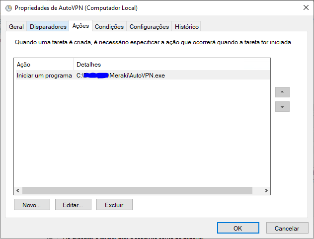

<h1>AUTOVPN MERAKI TROUBLESHOOTING</h1>

Este algoritmo foi criado com o propósito de reincitar o MX caso a AutoVPN Meraki viesse abaixo, como reiniciar o equipamento faz com que VPN retorne, então eu automatizei o processo como uma solução paliativa, mas este código pode ser complementado para realizar outras ações.

<h2>COMO UTILIZAR</h2>

Eu converti o fonte python para um executável, desta maneira eu posso terceirizar a execução para a Tarefa Agendada do Windows.

<h3>1 - Tarefa Agenda</h3>

